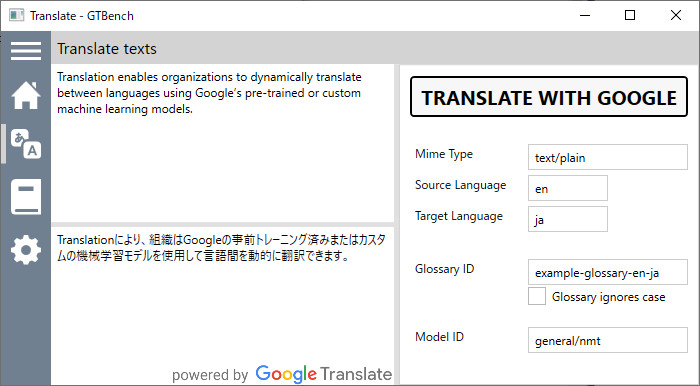

GTBench
=======
Tryout tool for Google's Cloud Translation (Advanced) API

## Summary

GTBench is a small Windows tool for developers and/or linguists to try features of Google's Cloud Translation API Advanced, formerly known as Translation API v3, without writing codes by themselves.

Translation API Advanced provides two major features over Translation API Basic (or v2): use of a glossary and/or a custom model.
The features sounds promising, but there is no easy-to-use way like [Google Transalte](https://translate.google.com) web interface to try those advanced features.

So, I wrote this tool to experience and evaluate how much it makes translation better.

## Features of GTBench

With GTBench, you can
* Create a _glossary resource_ on the cloud from an input _glossary file_ you provided, and
* Try translating some sample texts using the glossary.

You can also spcify a custom model upon translation if you have one already; for the moment GTBench lacks a feature to create a model.  You can always specify on the UI either of the two general models provided by Google: Neural Machine Translation model (`general/nmt`) and Phrase-Based Machine Translation model (`general/base`), however.

GTBench allows you to switch between glossaries (including no glossary) or models easily so that you can compare translation results from a same source text.

## Running GTBench

GTBench is a .NET Framework 4.7.2 application for Windows 10 PCs written in C#.  No other platforms are supported.
You need an appropriate development environment such as Visual Studio 2017 or later to build it.

To use GTBench, you need a Google Cloud Platform account.
Although you can consume Translation API for free of charge for some limited amounts every month,
you need to register your (or your company's) credit card for billing beforehand.
Then, you need to associate your _project_ to the billing account, enabling the project's accesses to Translation API.
You also need to setup an appropriate _service account_ for your project and download the _credentials file_ (aka _service account key file_) to your Windows 10 PC.

You can do them all on [Google Cloud Platform Console](https://console.cloud.google.com/).

Please refer to [Google's documentation](https://cloud.google.com/translate/docs/advanced/setup-advanced#before_you_begin) if you are not familiar with the Google Cloud Platform.

You need to tell GTBench your project (either by a Project ID or a Project Number) and the full pathname of your credentials file on the Settings page of GTBench when you run it for the first time.

## Legalese

Google Translate is used to power translation within GTBench. You can learn more on the Cloud Translation API on [https://cloud.google.com/translate].

THIS SERVICE MAY CONTAIN TRANSLATIONS POWERED BY GOOGLE. GOOGLE DISCLAIMS ALL WARRANTIES RELATED TO THE TRANSLATIONS, EXPRESS OR IMPLIED, INCLUDING ANY WARRANTIES OF ACCURACY, RELIABILITY, AND ANY IMPLIED WARRANTIES OF MERCHANTABILITY, FITNESS FOR A PARTICULAR PURPOSE AND NONINFRINGEMENT.

GTBench uses [Google.Cloud.Translate.V3 library](https://www.nuget.org/packages/Google.Cloud.Translate.V3/) by Google LLC distributed under [Apach license](https://www.nuget.org/packages/Google.Cloud.Translate.V3/2.0.0/license).

GTBench uses [HamburgerMenu](https://www.nuget.org/packages/HamburgerMenu/) by Alican Erdoğan distributed under the [MIT License](https://opensource.org/licenses/MIT).

GTBench uses [MahApps.Metro](https://github.com/MahApps/MahApps.Metro) toolkit by MahApps.Metro distributed under the [MIT License](https://licenses.nuget.org/MIT).

GTBench uses [SharpVectors](https://www.nuget.org/packages/SharpVectors.Reloaded/) library by Elinam LLC (Japan) distributed under the [BSD License](https://github.com/ElinamLLC/SharpVectors/blob/master/License.md)

GTBench as a whole is written by Alissa Sabre.